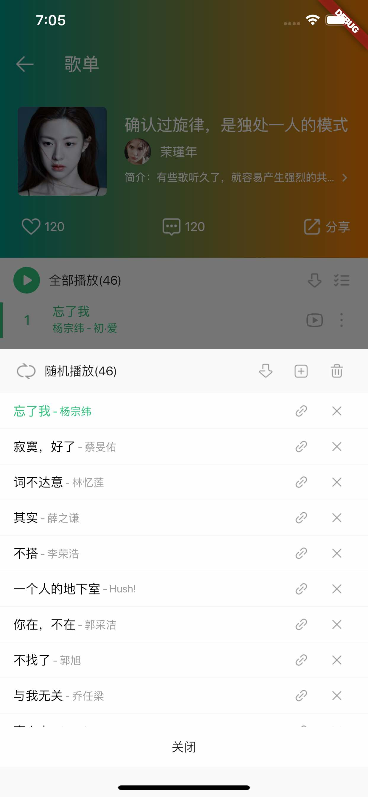
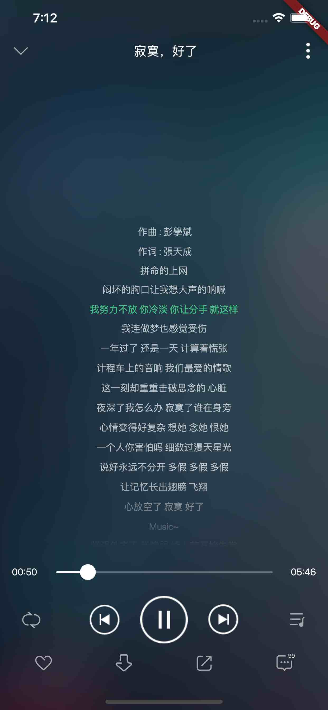

# qqmusic
flutter qqmusic

## 插件
```
cached_network_image: ^1.1.1 // 图片缓存
flutter_ijkplayer: ^0.3.3 // 音频和视频播放器
provider: ^3.1.0 // 状态管理
shared_preferences: ^0.5.3+4 // 本地存储数据，持久化，存储bool, double, int，string，list<string>类型
sqflite: ^1.1.7+1 // 本地存储数据，持久化，SQLite数据库，存储复杂数据类型
```

## 图片预览
| home | playlist | lyric |
|------|-----|----|
|| | | 

